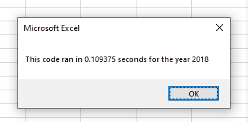
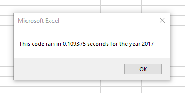

# VBA Challenge

## Overview of Project
For this challenge we were tasked with refactoring our previous stock analysis workbook to make it run faster, be more scalable, and more sustainable. 

### Purpose
The purpose of this workbook is to provide an easy to review analysis of stock performances based on the ticker and year. The client only needs to click the button "Run Analysis for All" then input the year of data desired to see the different tickers, their total volumes, and their returns. This will make helping their customers choose profitable stock options easier.

## Analysis and Challenges
Initially the customer wanted to specifically review the data for DQ, due to personal ties to the ticker name. When reviewing the "DQ" ticker specifically, from 2017 to 2018 the stock has decreased in return significantly, from 199.4% in 2017 
 to a -62.6% return in 2018.
 Out of all the stocks reviewed, only RUN managed to increase in 2018, which should be taken into consideration.
 
 ### Challenges
 The major challenge in making a fully informed decision is that the data has such a large variance between the two years that without providing additional years' data, the information very well be skewed. However, with the refactoring of the code, and the ease of use from the client's perspective, it would not be difficult to import other years' data & run the same macro to see a larger data set. Thanks to the year being reviewed being a variable, coded as `yearValue = InputBox("What year would you like to run the analysis on?")` the user need only input what year they'd like to review. And with accompanying instructions on how to import additional data, the process should be seamless.
 
 From a coding perspective, I struggled with understanding how to define & initialize arrays correctly. However upon extensive research I learned that the solution would be 
 `Dim tickerVolumes(12) As Long
  Dim tickerStartingPrices(12) As Single
  Dim tickerEndingPrices(12) As Single
     
    '2a) Create a for loop to initialize the tickerVolumes to zero.
    'https://www.automateexcel.com/vba/declare-dim-create-initialize-array/#Populate_Array_with_Loop
   
    'declare an integer for the loop
       Dim i As Integer
   
    'redim the array to the amount of rows in the range.
      
       For i = 0 To 11
          tickerVolumes(i) = 0
       Next i
`
Once I understood how to correctly initialize tickerVolumes, the rest was fairly straightforward.

## Summary
### Advantages & disadvantages to refactoring code
Refactoring code, while time consuming, allows for a more sustainable user experience. With code that has not been fully optimized, any issues that arise during scaling, debugging, and excecution can be better addressed. For example, if the client wanted to include the same data for years 2019-2020, the program may run significantly slower as it was not optimized for additional years of review other than 2017-2018. Also, when refactoring code, you're forced to look at the data in a more all encompassing way, where it is not just providing a one-time solution, which can later be used as a basis for other solutions or analysis. The disadvantages are the amount of time it takes compared to writing the initial code, and the potential for issues later on, because I think it would be impossible to predict future compatibility, etc. 
In this case, the main reason provided to refactor was to optimize performance and speed. In the original macro, 2018 data was ran in .05898438 seconds. In the refactored macro this was reduced to 0.109375 seconds. . Similarly, the unoptimized macro ran 2017 data in .5820312 seconds, compared to .109375 seconds . While the amounts seem miniscule, when scaled this can make a major difference in processing efficiency. 
  
 
 ##
